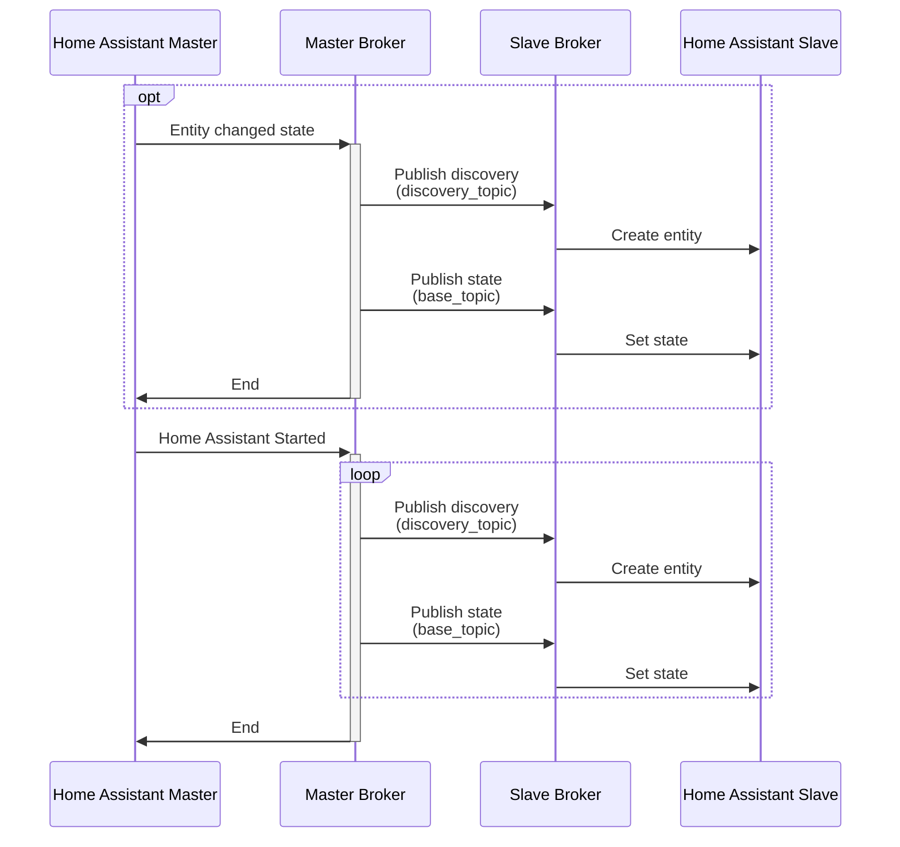
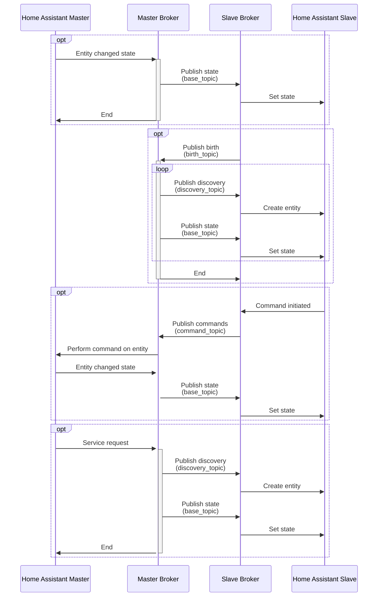

[](https://github.com/RogerSelwyn/mqtt_discoverystream_ha/actions/workflows/validate_hassfest.yaml) [](https://github.com/RogerSelwyn/mqtt_discoverystream_ha/actions/workflows/validate_hacs.yaml) [](https://www.codefactor.io/repository/github/rogerselwyn/mqtt_discoverystream_ha) [](https://github.com/RogerSelwyn/mqtt_discoverystream_ha/releases/latest)

 [](#) [](https://github.com/RogerSelwyn) [](https://github.com/hacs/integration) 

### This is a very substantial re-write of the version by @koying which adds Climate and Cover support as well as providing a couple of fixes. It is available to be merged back if desired.

# MQTT DiscoveryStream integration for Home Assistant

This is an "extension" of the builtin [`mqtt_statestream`](https://www.home-assistant.io/integrations/mqtt_statestream/) integration.  
Besides the functionalities of the hereabove, it also allows to publish and handles an [MQTT "discovery"](https://www.home-assistant.io/docs/mqtt/discovery) setup.

## Supported entities
Provides discovery support for:
- Binary Sensor
- Climate
- Cover
- Light
- Sensor
- Switch

## Pre-requisites

1. MQTT configured

## Installation

### HACS

1. Launch HACS
1. Navigate to the Integrations section
1. Add this repository as an Custom Repository (Integration) via the menu at top right (Only required if you wish to use this forked version).
1. Search for "MQTT DiscoveryStream"
1. Select "Install this repository"
1. Restart Home Assistant

### Home Assistant

The integration is configured via YAML only.

Example:

```yaml
mqtt_discoverystream:
  base_topic: test_HA
  publish_attributes: false
  publish_timestamps: true
  publish_discovery: true
  include:
    entities:
      - sensor.owm_hourly_humidity
      - sensor.jellyfin_cloud
      - light.wled_esp
  exclude:
    entities:
      - sensor.plug_xiaomi_1_electrical_measurement
```

## Configuration

### Options

This integration can only be configured via YAML.
The base options are the same as the mqtt_statestream one. 

| key                | default | required | description                                                                      |
| ------------------ | ------- | -------- | -------------------------------------------------------------------------------- |
| base_topic         | none    | yes      | Base topic used to generate the actual topic used to publish.                    |
| discovery_topic    | none    | no       | Topic where the configuration topics will be created. Defaults to base_topic     |
| command_topic      | none    | no       | Topic where any command responses will be created. Defaults to base_topic        |
| birth_topic        | none    | no       | Topic where birth message will be subscribed. Defaults to base_topic + `/status` |
| publish_attributes | false   | no       | Publish attributes of the entity as well as the state.                           |
| publish_timestamps | false   | no       | Publish the last_changed and last_updated timestamps for the entity.             |
| publish_discovery  | false   | no       | Publish the discovery topic ("config").                                          |
| publish_retain     | false   | no       | When set to true publishes messages with retain bit turned on.                   |
| include / exclude  | none    | no       | Configure which integrations should be included / excluded from publishing.      |

## Services

A service called `publish_discovery_state` is provided when `publish_discovery` is enabled in the configuration. The service triggers a re-publication of the discovery and current state information for each entity that matches the inclusion/exclusion filter. There are no attributes/parameters for the service.

## Topic Handling

* Discovery messages will be published to the `discovery_topic` when `publish_discovery` is enabled. 
* State messages will be sent to the `base_topic`.
* Commands from entities at the slave site will be subscribed to on the `command_topic`.
* Birth messages from the slave site will be subscribed to on the `birth_topic`, which must end in `/status`. `/status` will be added to the topic if missing. 

## Discovery of entities and Publication of states

Discovery and state messages will be published under 4 situations:
1. Completion of Home Assistant startup
1. Connection of slave broker and receipt of `online` message at the `birth_topic`
1. Initiation of `publish_discovery_state` service
1. First change of state of an entity, where none of the first 3 items has occurred 

## Flowchart

### Startup


### Running



## Credits

- This custom component is based upon the `mqtt_statestream` one from HA Core.  
