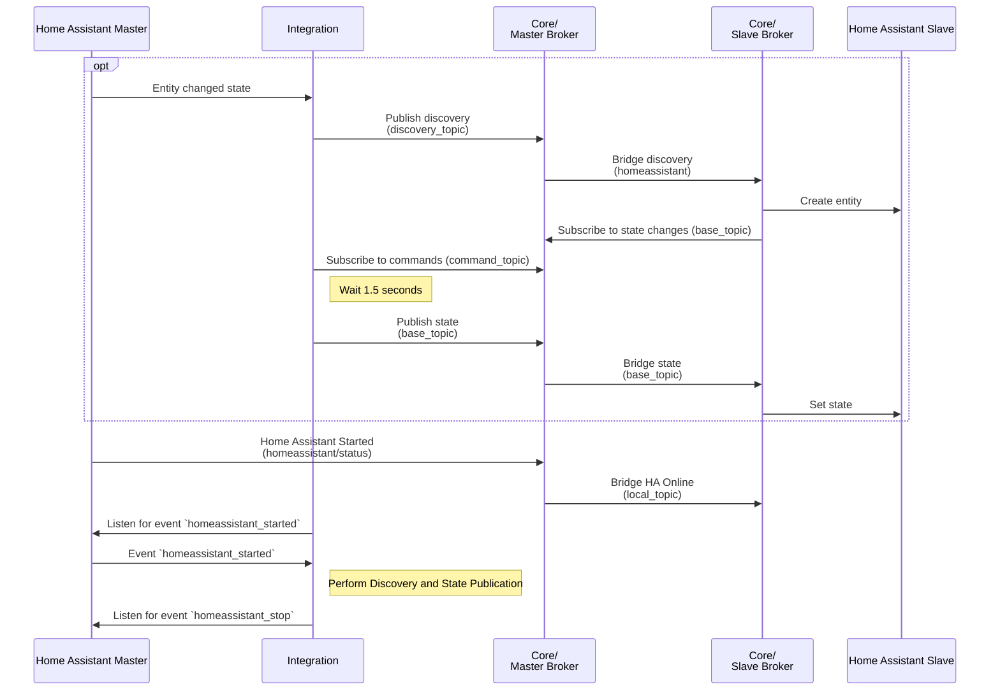
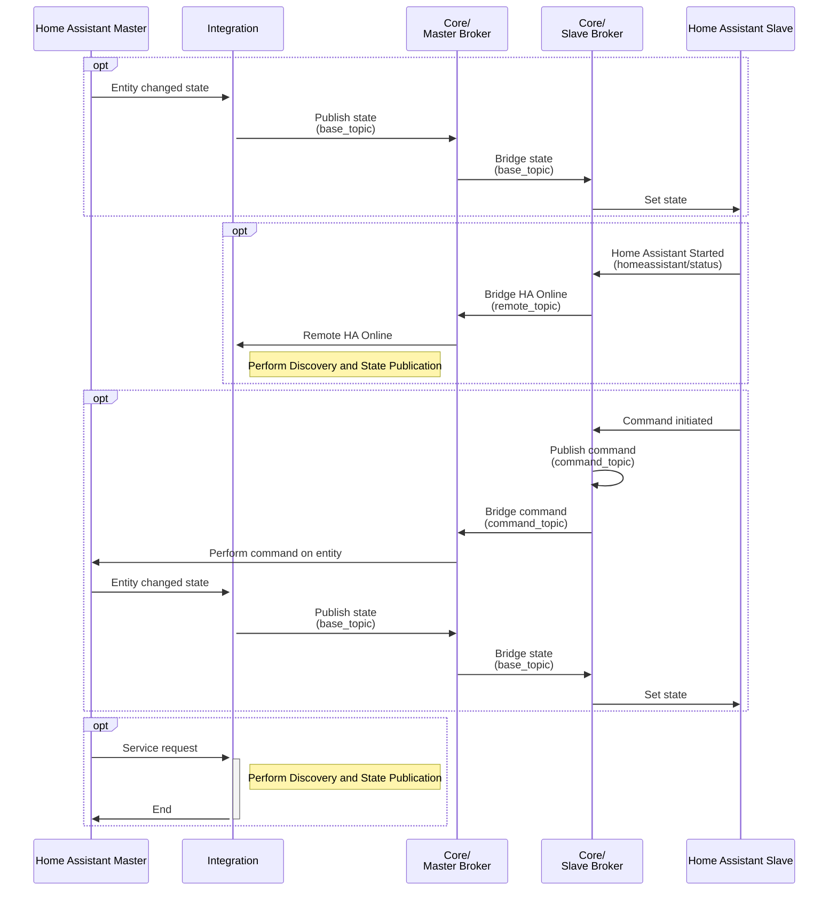
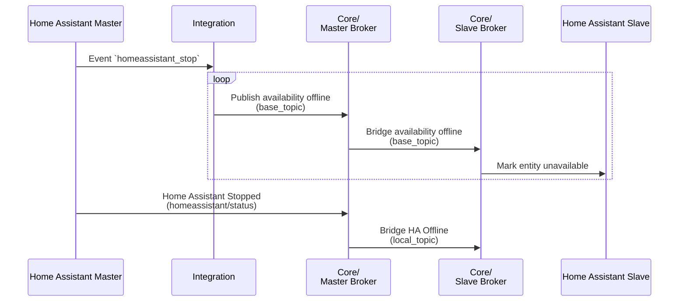
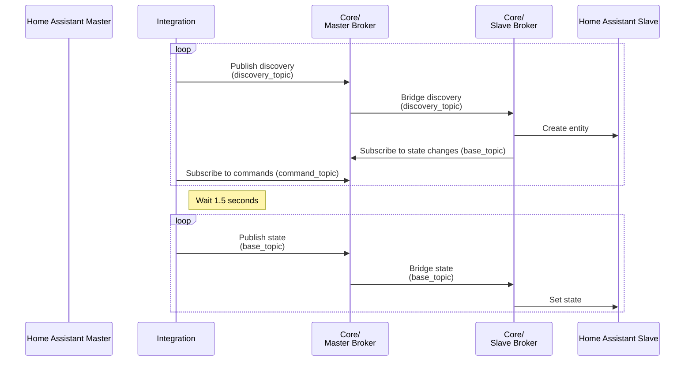

[](https://github.com/RogerSelwyn/mqtt_discoverystream_ha/actions/workflows/validate_hassfest.yaml) [](https://github.com/RogerSelwyn/mqtt_discoverystream_ha/actions/workflows/validate_hacs.yaml) [](https://www.codefactor.io/repository/github/rogerselwyn/mqtt_discoverystream_ha) [](https://github.com/RogerSelwyn/mqtt_discoverystream_ha/releases/latest)

 [](#) [](https://github.com/RogerSelwyn) [](https://github.com/hacs/integration) 

# MQTT DiscoveryStream integration for Home Assistant

This is an "extension" of the builtin [`mqtt_statestream`](https://www.home-assistant.io/integrations/mqtt_statestream/) integration.  
Besides the functionalities of the hereabove, it also allows to publish and handles an [MQTT "discovery"](https://www.home-assistant.io/docs/mqtt/discovery) setup.

## Supported entities
Provides discovery & command support for:

| **Entity Type** | **Entity Created** | **Commands Supported**    |
|:----------------|:-------------------|:--------------------------|
| Binary Sensor   | binary_sensor      |                           |
| Button          | button             | Press                     |
| Climate         | climate            | Set HVAC Mode, Set Preset Mode, Set Temperature |
| Cover           | cover              | Open, Close, Stop, Set Position, Set Tilt Position |
| Device Tracker  | device_tracker     |                           |
| Event           | event              |                           |
| Input Boolean   | switch             | Turn On, Turn Off         |
| Input Button    | button             | Press                     |
| Input Number    | number             | Set Value                 |
| Input Select    | select             | Select Option             |
| Input Text      | text               | Set Value                 |
| Light           | light              | Turn On, Turn Off         |
| Number          | number             | Set Value                 |
| Scene           | scene              | Apply                     |
| Sensor          | sensor             |                           |
| Select          | select             | Select Option             |
| Switch          | switch             | Turn On, Turn Off         |
| Text            | text               | Set Value                 |

## [Buy Me A Beer 🍻](https://buymeacoffee.com/rogtp)
I work on this integration because I like things to work well for myself and others. Whilst I have now made significant changes to the integration, it would not be as it stands today without the major work to create it put in by @koying. Please don't feel you are obligated to donate, but of course it is appreciated.

<a href="https://www.buymeacoffee.com/rogtp" target="_blank"></a> 
<a href="https://www.paypal.com/donate/?hosted_button_id=F7TGHNGH7A526">
  
</a>

## Pre-requisites

1. MQTT configured

## Installation

### HACS

1. Launch HACS
1. Navigate to the Integrations section
1. Add this repository as an Custom Repository (Integration) via the menu at top right (Only required if you wish to use this forked version).
1. Search for "MQTT DiscoveryStream"
1. Select "Install this repository"
1. Restart Home Assistant

### Home Assistant

The integration is configured via YAML only.

Example:

```yaml
mqtt_discoverystream_alt:
  base_topic: test_HA
  publish_attributes: false
  publish_timestamps: true
  publish_discovery: true
  include:
    entities:
      - sensor.owm_hourly_humidity
      - sensor.jellyfin_cloud
      - light.wled_esp
  exclude:
    entities:
      - sensor.plug_xiaomi_1_electrical_measurement
```

## Configuration

### Options

This integration can only be configured via YAML.
The base options are the same as the mqtt_statestream one. 

| key                | default | required | description                                                                        |
| ------------------ | ------- | -------- | ---------------------------------------------------------------------------------- |
| base_topic         | none    | yes      | Base topic used to generate the actual topic used to publish.                      |
| discovery_topic    | --->    | no       | Topic where the configuration topics will be created. Defaults to base_topic       |
| command_topic      | --->    | no       | Topic where any command responses will be created. Defaults to base_topic          |
| publish_attributes | false   | no       | Publish attributes of the entity as well as the state.                             |
| publish_timestamps | false   | no       | Publish the last_changed and last_updated timestamps for the entity.               |
| publish_discovery  | false   | no       | Publish the discovery topic ("config").                                            |
| publish_retain     | false   | no       | When set to true publishes messages with retain bit turned on.                     |
| republish_time     | 5 mins  | no       | Sets the time between iterations of republishing discovery/state for all entities. |
| include / exclude  | none    | no       | Configure which integrations should be included / excluded from publishing.        |
| local_status       | none    | no       | See below                                                                          |
| remote_status      | none    | no       | See below                                                                          |


#### local_status

In order for the remote HA instance to be informed when the local HA instance goes offline (and therefore its entities are unavailable), the local HA status needs to be available at the remote broker. By default, at the local end it is located at `homeassistant/status`, which users will likely rewrite to a different location on the remote broker.

| key                | default | required | description                                                                        |
| ------------------ | ------- | -------- | ---------------------------------------------------------------------------------- |
| topic              | none    | no       | Topic at the slave for master's HA status. Defaults to base_topic + `/status`.     |
| online_status      | online  | no       | As configured in MQTT integration for master's HA online status.                   |
| offline_status     | offline | no       | As configured in MQTT integration for master's HA offline status.                  |

```yaml
  local_status:
    topic: master/status
    online_status: online
    offline_status: offline
```


#### remote_status

In order for the master HA instance to be informed when the remote HA instance has come online (and therefore that it should resend discovery information), the remote HA status needs to be available at the local broker. By default, at the remote end it is located at `homeassistant/status`, which users will likely rewrite to a different location on the local broker.

| key                | default | required | description                                                                        |
| ------------------ | ------- | -------- | ---------------------------------------------------------------------------------- |
| topic              | none    | no       | Topic at the master for slave's HA status. Defaults to base_topic + `/status`.     |
| online_status      | online  | no       | As configured in MQTT integration for slave's HA online status.                    |

```yaml
  remote_status:
    topic: master/status
    online_status: online
```

## Services

A service called `publish_discovery_state` is provided when `publish_discovery` is enabled in the configuration. The service triggers a re-publication of the discovery and current state information for each entity that matches the inclusion/exclusion filter. There are no attributes/parameters for the service.

## Topic Handling

* Discovery messages will be published to the `discovery_topic` when `publish_discovery` is enabled. 
* State messages will be sent to the `base_topic`.
* Commands from entities at the slave site will be subscribed to on the `command_topic`.
* Birth messages from the slave site will be subscribed to on the `birth_topic`, which must end in `/status`. `/status` will be added to the topic if missing. 

## Discovery of entities and Publication of states

Discovery and state messages will be published under 4 situations:
1. Completion of Home Assistant startup
1. Connection of slave broker and receipt of `online` message at the `birth_topic`
1. Initiation of `publish_discovery_state` service
1. First change of state of an entity, where none of the first 3 items has occurred 

## Flowchart

### Startup


### Running


### Shutdown

### Discovery and State Publication


## Credits

- This custom component is based upon the `mqtt_statestream` one from HA Core.  
